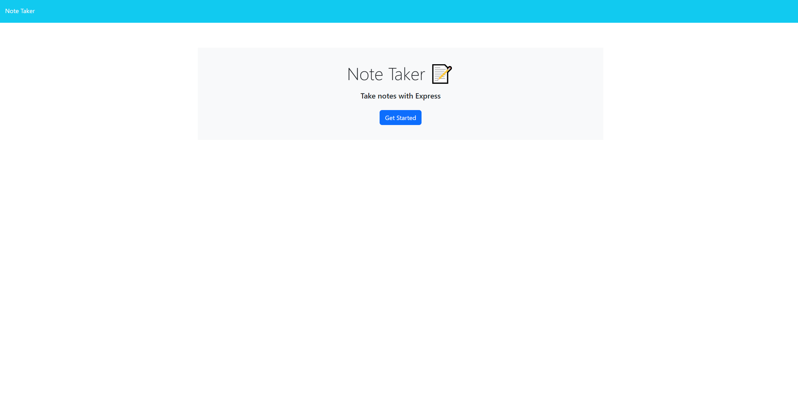
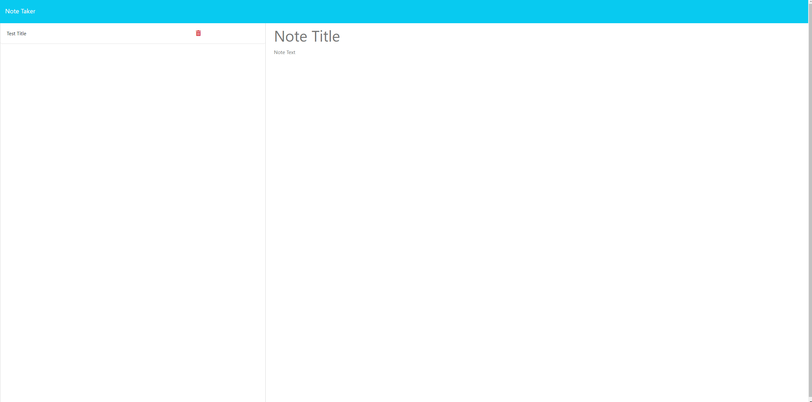
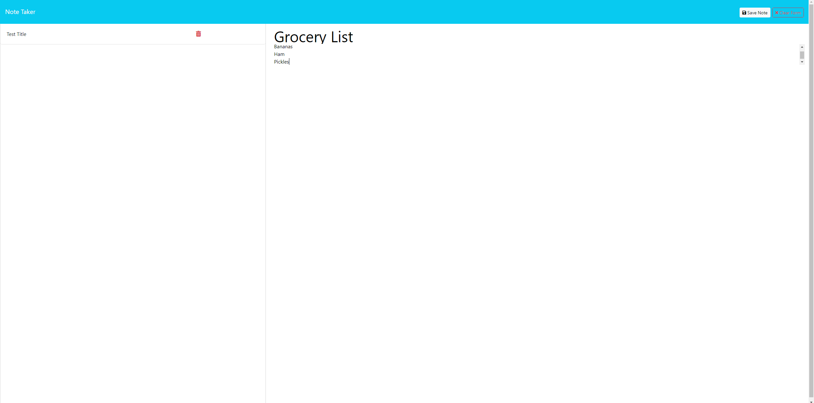
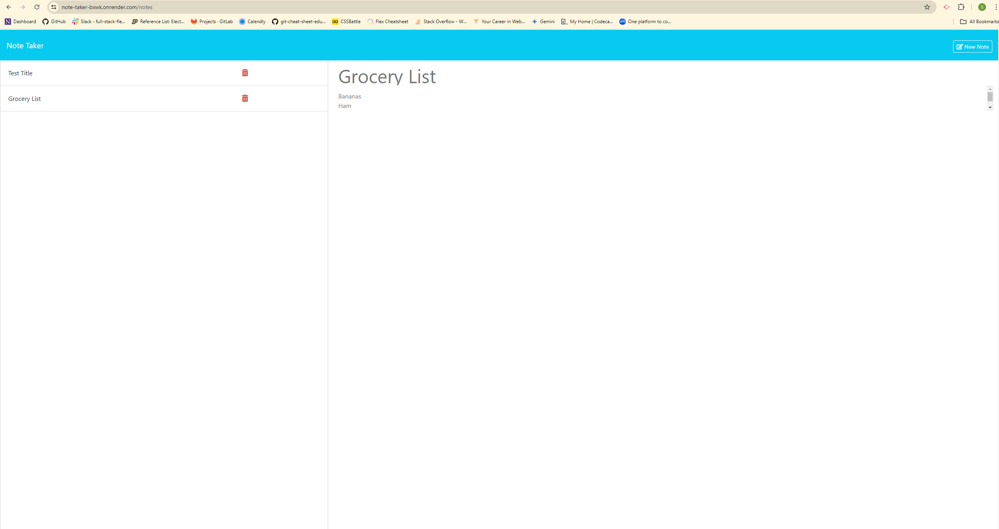

# Note Taker

## Description

Note Taker is a web application that allows users to write, save, and delete notes. This application uses Express.js for the backend and Bootstrap for styling the frontend. The notes are saved in a JSON file on the server.

## Table of Contents

- [Installation](#installation)
- [Usage](#usage)
- [Screenshots](#screenshots)
- [Technologies Used](#technologies-used)
- [License](#license)

## Installation

1. Clone the repository to your local machine:
   git clone https://github.com/yourusername/note-taker.git
2. Install Dependencies 

    npm install
3. Start

    node server.js

## Usage 
1. Open your browser and navigate to http://localhost:3000.

2. Click the "Get Started" button to view and manage your notes.

3. Use the "New Note" button to create a new note. Enter the title and text of your note, and click the "Save Note" button to save it.

4. Click on a note in the list to view it.

5. Use the delete button (trash icon) next to a note to delete it.

## Screenshots 

## Technologies Used
* Express.js
* Node.js
* Bootstrap
* Font Awesome
* JavaScript
* HTML
* CSS

## License
This project is licensed under the ISC License.